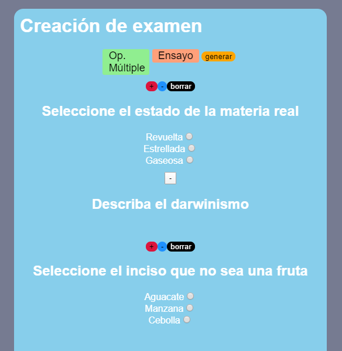
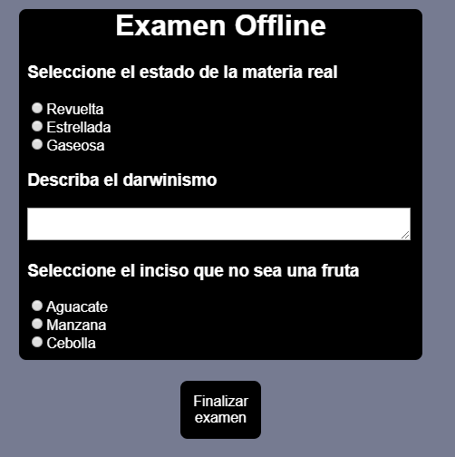

# Test's password (student mode): __batman__

> $ npm install

> $ npm start

## Offline Academic Stantardization tool
> The mexican public education model's approach to the contingency relies on TV to reach the students on their homes. Although this is a way to cope with the challenges of our times, it does not allow for test application, and thus, do not allow for academic stantardization. TV was the media of choice since several regions of the country are still offline, due to development and/or economical reasons.

This program allows for the creationg of a quiz composed of two types of questions:
* Essay questions
* Multiple choice questions

This tool allows for santardization by digital quizes distributed via alternative media that bypass the need for an internet conection.

It uses two forms of cryptography:
* **cifrado basado en contraseña** (AES aumentado por PBKDF2)
* **Password based** (AES+PBKDF2)
* **Asymetric cryptography** (RSA)

AES allows for the definition of a human-friendly key that could be distributed via other kinds of media, like radio or TV.

The file that's sent to a given household carries the encrypted quiz, the salt and a public RSA key.
The latter enables the student's answers to be then encrypted once it's been completed. Encryption prevents the exam from being subject to illegal modifications after it's been finished.

## Screenshots

