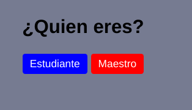
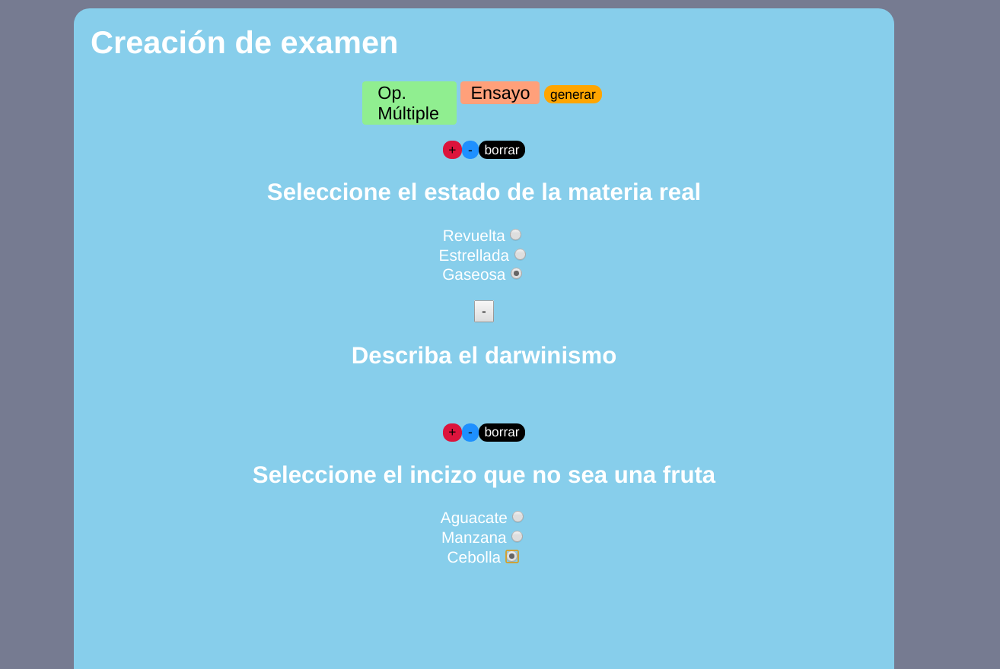
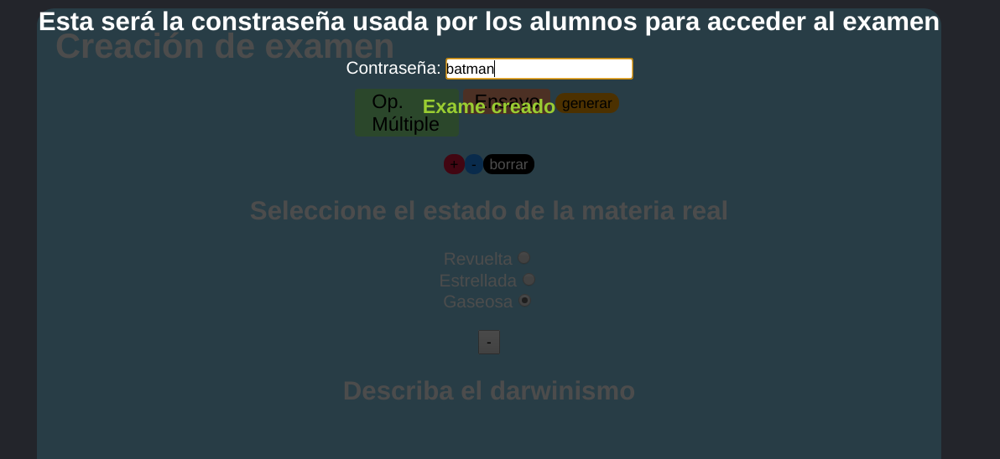
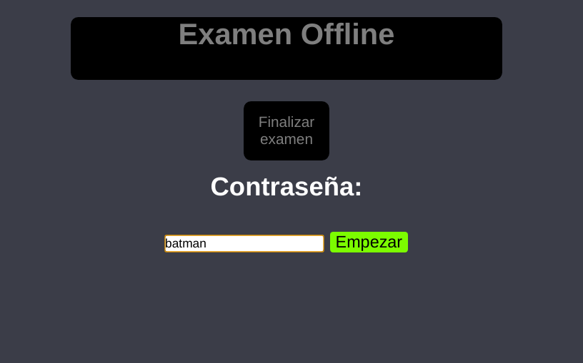
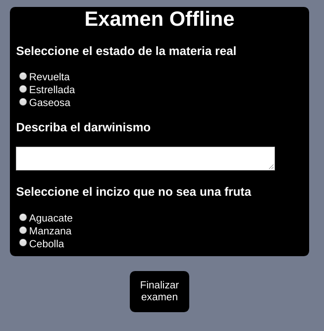

# Contraseña para pruebas (modo estudiante): __batman__

## Plataforma de Estandarización Académica Offline
> El modelo público de enseñanza mexicana como respuesta a la contingencia consiste en la impartición de clases por medio de la televisión, que si bien es una manera de solventar el problema, no permite la aplicación de pruebas (exámenes) que sirven como instrumento de medición de la efectividad del sistema educativo. 

Este proyecto es una prueba de concepto del empleo de tecnologías existentes con la finalidad de asegurar la continuidad de la educación en México

Este programa permite la creación y aplicación de exámenes con dos tipos de preguntas
* Preguntas de tipo ensayo
* Preguntas de opción múltiple

El proyecto es una prueba de concepto de un sistema que permita la estandarización por medio de exámenes digitales distribuidos por diferentes medios auxiliares que solventan la ausencia del servicio de internet.

Lo logra empleando dos tipos de cifrado: 
* **cifrado basado en contraseña** (AES aumentado por PBKDF2)
* **cifrado asimétrico** (RSA)

El cifrado AES permite la definición de una llave amigable al usuario que sea distribuida por medios 
análogos al internet, como por ejemplo la radio o la televisión, de la misma manera en que se imparten clases
en casa a razón de la cuarentena.

El archivo que se le hace llegar a la familia en contexto carga consigo el examen cifrado por la contraseña, la *salt* 
y la llave pública RSA.  

Ésta última permite el posterior cifrado del archivo generado por las respuestas del alumno, con la intención
de prevenir modificaciónes que no se pueden evitar en un modelo de enseñanza carente de una conexión a internet.

## Capturas de pantalla

